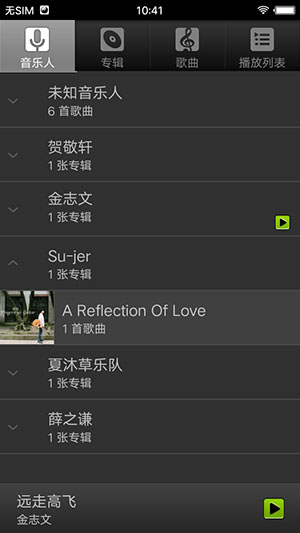
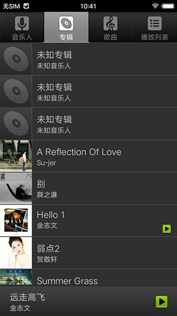
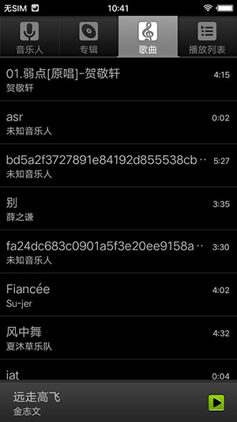
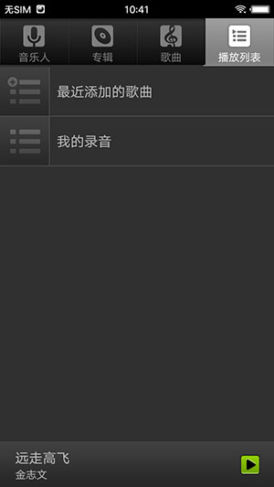
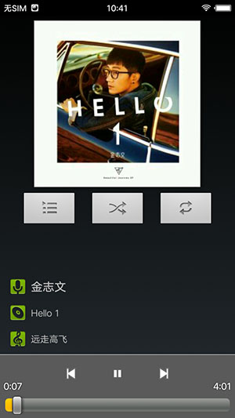

## SoundRecorder
    这是一个android4.4.4上的音乐的源码

播放的主要实现是由 MediaPlaybackService 来实现的, 并且还通过aidl来暴露出相关的接口,供UI调用

这种IPC通信的写法和封装很值得参考和借鉴!!(MusicUtils中封装的方法也很有意思)

	[IMediaPlaybackService.aidl]

	interface IMediaPlaybackService
	{
	    void openFile(String path);
	    void open(in long [] list, int position);
	    int getQueuePosition();
	    boolean isPlaying();
	    void stop();
	    void pause();
	    void play();
	    void prev();
	    void next();
	    long duration();
	    long position();
	    long seek(long pos);
	    String getTrackName();
	    String getAlbumName();
	    long getAlbumId();
	    String getArtistName();
	    long getArtistId();
	    void enqueue(in long [] list, int action);
	    long [] getQueue();
	    void moveQueueItem(int from, int to);
	    void setQueuePosition(int index);
	    String getPath();
	    long getAudioId();
	    void setShuffleMode(int shufflemode);
	    int getShuffleMode();
	    int removeTracks(int first, int last);
	    int removeTrack(long id);
	    void setRepeatMode(int repeatmode);
	    int getRepeatMode();
	    int getMediaMountedCount();
	    int getAudioSessionId();
	}

